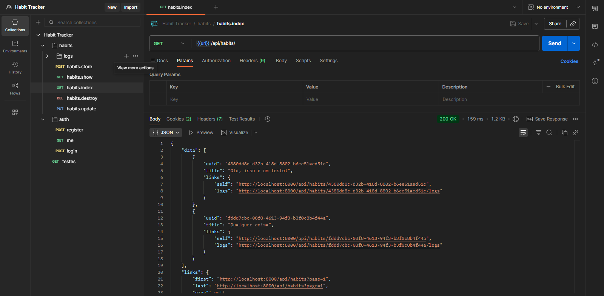
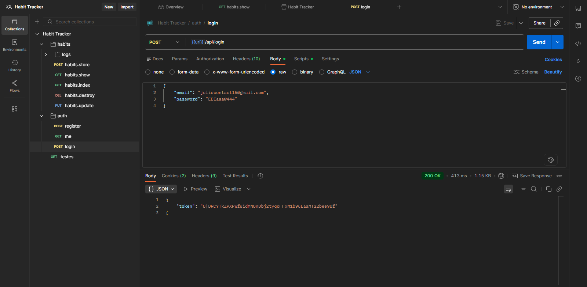
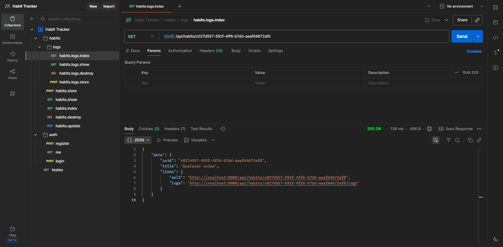
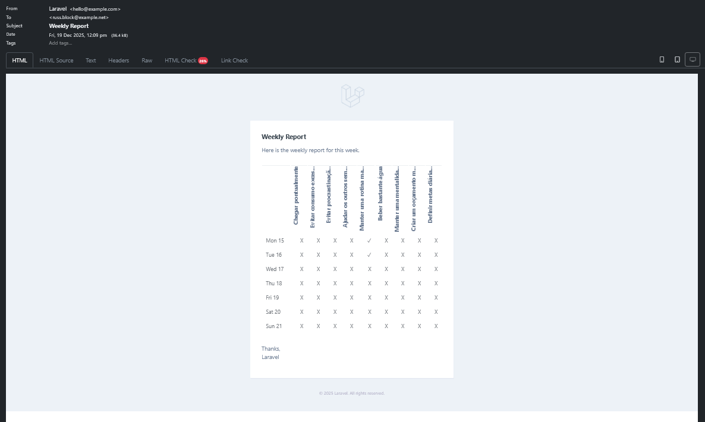

# 👨🏻‍💻🎯 [Habit Tracker Api](https://github.com/ojulio-dev/habit-tracker-api)

<br />

<p align="center">
  
</p>

<p align="center">
Aplicação desenvolvida na Formação de PHP da Rocketseat.
</p>

<p align="center">
  
</p>

<br />

<p align="center">
  
</p>

*Um sistema de API 100% funcional para controle de hábitos e tarefas! 🕒*

## 📖 Sobre o projeto

<p>
  O <b>Habit Tracker Api</b> é um sistema de <b>API  REST</b> desenvolvido para o gerenciamento de hábitos e tarefas. Feito para ser consumido por outras <b>aplicações</b>, o <b>Habit Tracker Api</b> não retorna nenhuma <b>View</b> em suas requisições, apenas dados em formato <b>JSON</b>.
</p>


## 🎯 Funcionalidades 

* Autenticação segura com o **Laravel Sanctum**;
* Controle de rotas com o método **apiResource**;
* Controle total de **hábitos**;
* Relatório semanal dos **hábitos** concluídos e não concluídos, via **e-mail**;
* **Factories** e **Seeders** definidas para realização de **testes** à vontade.

<p align="center">
  
</p>

## 🧪 Ferramentas de Desenvolvimento
* **Requisições:** Postman;
* **Database Viewer:** Beekeeper Studio.

## 🚀 Tecnologias e Linguagens

* **Backend:** PHP;
* **Banco de dados:** SQLite;
* Programação Orientada a Objetos.

<p align="center">
  
</p>


## 🛠️ Bibliotecas e Frameworks

* **Framework:** Laravel 11;
* **Depuração:** LaraDumps;
* **Formatação de códigos:** Pint;
* **Refatoração de códigos:** Rector.

<p align="center">
  
</p>

## 📌 Pré-requisitos e Instalação

1. Clonar o repositório;
```
git clone git@github.com:ojulio-dev/habit-tracker-api.git habit-tracker-api && cd habit-tracker-api/
```

2. Instalar o Composer;
```
composer install
```

3. Gerar o arquivo das configurações de ambiente;
```
cp .env.example .env
```

4. Gerar a chave da aplicação;
```
php artisan key:generate
```

5. Criar a Database do projeto;
```
php artisan migrate
```

6. Gerar as Seeders do projeto;
```
php artisan db:seed
```

7. Iniciar o servidor web.
```
php artisan serve
```

## 💡 Instruções de Uso

Basta abrir o seu gerenciador de **Requisições HTTP**, vincular com o servidor e testar à vontade 😄

## 📜 Licença

<p align="center"><b>Julio Cesar 2025.</b> Todos os direitos reservados</p>